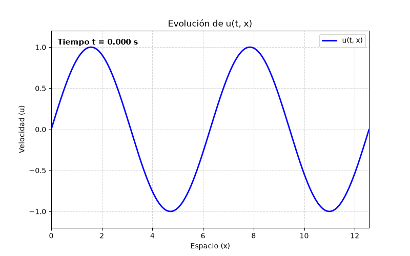
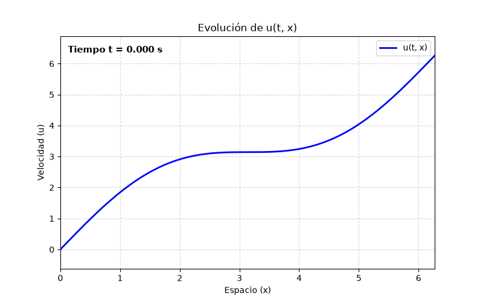
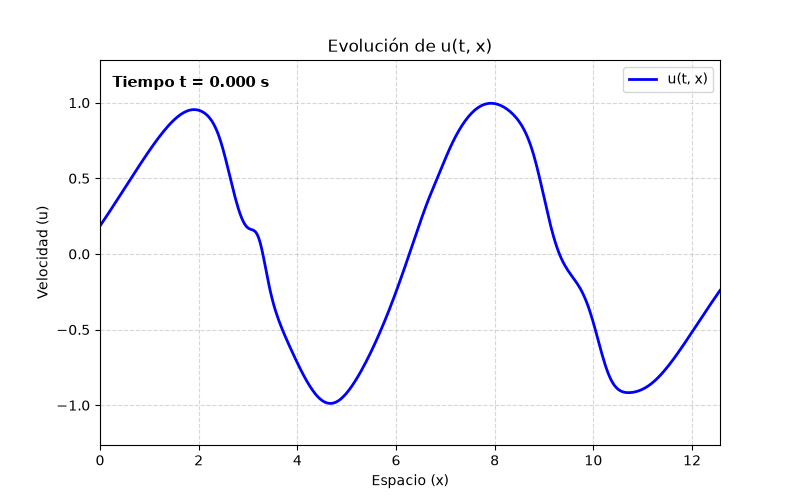
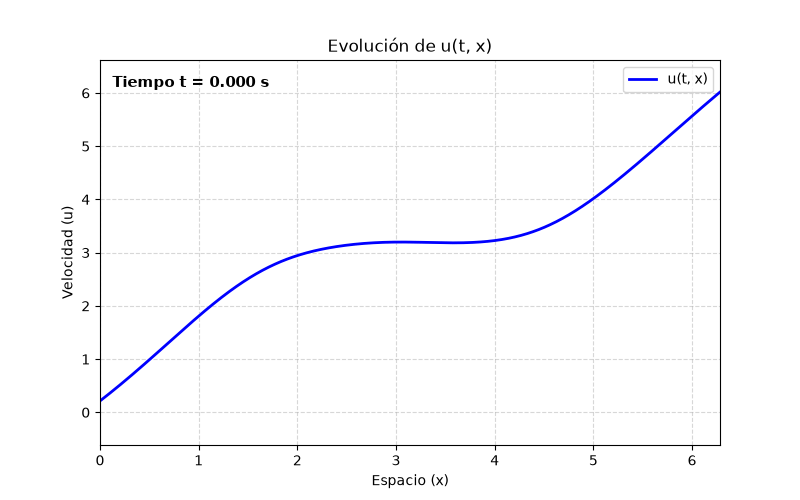
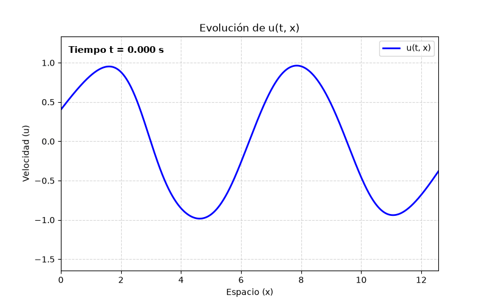
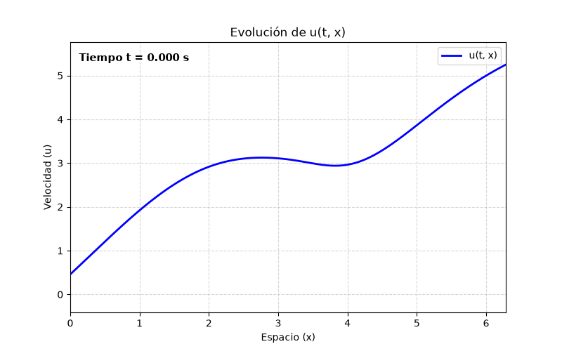
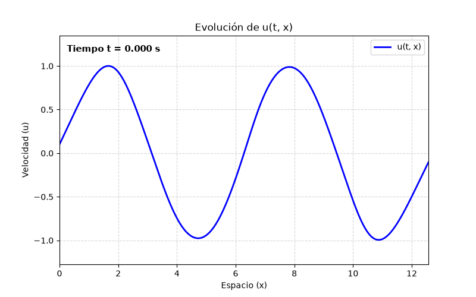

# Machine Learning para simulación de sistemas dinámicos

## Resumen

La manera más natural de aproximar soluciones de sistemas dinámicos modelados mediante ecuaciones diferenciales son los métodos numéricos. Sin embargo, en determinadas situaciones, estas técnicas pueden no funcionar o resultar demasiado costosas. Por ejemplo, si nos encontramos ante un problema muy complejo o difícil de modelar de manera suficientemente satisfactoria entonces, aunque nuestro método rinda bien, puede no resolver nuestro problema original. Además, si trabajamos en dimensiones altas o necesitamos correr repetidas veces la simulación pueden resultar demasiados costosos.

En este contexto, si además disponemos de datos experimentales, es donde aparecen los sistemas de aprendizaje automatico informados por física. Técnicas que tratan de forzar conocimiento a priori en sistemas de aprendizaje automatico.

En este proyecto simularemos mediante el método de volúmenes finitos la ecuación de Burguers inviscida para, a continuación, usar esos datos para entrenar una red neuroral clásica y otra informada por física. El objetivo es comporbar la diferencia de rendimeinto entre ambas y ver si, forzando conocimiento a priori de problema en la red, podemos obtener mejores resultados y mayor eficiencia.

## Índice

1. [Introducción](#id1)
2. [Estructura del proyecto](#id2)
3. [Simulación usando volúmenes finitos](#id3)
4. [Simulación usando NNs](#id4)
5. [Simulación usando PINNs](#id5)
6. [Próximos pasos](#id6)
7. [Conclusión](#id7)
8. [Dependencias](#id8)
9. [Cómo ejecutar el código](#id9)

## Introducción 
Uno de los problemas que más naturalmente aparece en las matemáticas aplicadas es: dado un sistema que evoluciona con el tiempo, tratar de predecir cual va a ser el estado en que se encuentre el sistema en un futuro.

Este problema tiene dos formas principales de ser abordado. Si asumimos que no somos capaces de determinar las reglas que rigen como cambia el sistema o si, por el contrario, nos creemos con la capacidad de conocerlas. El primero de los escenarios parece muy desalentador pero, si disponemos de una cantiad considerable de datos experimentales, resulta que, usando técnicas de aprendizaje automático, en muchos casos es posible resolver de manera bastante satisfactoria el problema.

Por otro lado, si de hecho somos capaces de modelar el sistema, entonces podremos usar otro tipo de técnicas como pueden ser las ecuaciones diferenciales y los procesos estocásticos.

Cada una de estas aproximaciones tiene sus inconvenientes. Para aplicar aprendizaje automático necesitaremos una cantidad bastante grande de datos que sean limpios y representativos. Para aplicar ecuaciones diferenciales necesitaremos asumir que podemos modelizar el problema de forma suficientemente satisfacotria y luego podremos resolver o simular las ecuaciones resultantes. 

El problema que nos planteamos en este proyecto es: ¿Que pasa si tengo un sistema del que dispongo algunos datos experimentales y también algo de información a priori de las reglas que rigen la evolución?

Puede ser que no disponga de suficientes datos para aplicar aprendizaje automático y que, además, el sistema sea demasiado complejo como para asumir que puedo determinar las reglas que modelan su evolución de una forma suficientemente satisfactoria. Pero ¿Puedo de alguna forma convinar todas las informaciones que tengo en una especie de sistema mixto? ¿Puedo aplicar aprendizaje automático pero forzarlo a que respete ciertas reglas que se a priori?

Esto será el problema que trabajaremos en este proyecto.

### Breve comentario sobre ML
Antes de nada es necesario hacer un breve comentario sobre como funcionan las redes neuronales, un tipo de técnica de aprendizaje automático. Lo haré de forma intuitiva y heurística porque no es el objetivo de este documento hacer una discusión detallada sobre esto.\
Esencialmente, una red nuronal es una funcion matemática seleccionada de entre una familia de funciones para minimizar un coste o error. \
El determinar entre que familias de funciones vamos a buscar es el seleccionar la arquitectura de la red. El proceso de seleccionar cual de los elementos de esa familia es el óptimo es el proceso de entrenamiento materializado en un algoritmo de optimizacion.

Por lo tanto, podriamos intentar introducir nuestro conocimiento a priori del sistema de varias formas diferentes:
- Imponiendo la forma de la función solución. Si sabemos de que forma debe de ser la función solución podemos elegir una arquitectura que fuerze ese tipo de estructura.
- Forzando que la solución satisfaga una propiedad concreta. Si sabemos que la solución debe cumplir cierta regla podemos añadir términos a la función de coste que penalicen fuertemente soluciones que no satisfacen esas reglas.
- A través del algoritmo de optimización empleado. Cada algoritmo tiene propiedades y comportamientos diferentes y conociendolos podemos promover ciertos resultados.
- Otros. Por ejemplo, si sabemos que la información realmente importante del sistema es de una dimensión muy inferior al input podemos usar Autoencoders.

En concreto, lo que exploraremos en este proyecto en la adición de términos a la función de perdida. Implementaremos una red neuronal estandar y modificaremos la función de coste para forzar que las soluciones sigan ciertas reglas.

## Estructura del proyecto 

El primer paso será seleccionar el problema que queremos resolver. En este caso trabajaremos sobre un sistema perfectamente dominado por la ecuación de Burguers inviscida de una dimensión, por ejemplo, el flujo de tráfico en una carretera. La elección está motivada por ser la continuación natural de un trabajo previo sobre el método de volúmenes finitos aplicado a la ecuación del transporte.

A continuación, deberemos simular datos de nuestro sistema. Para ello, por el mismo motivo de antes, implementaremos el método de volúmenes finitos para la ecuación de Burguers inviscida.

Finalmente usaremos los datos de la simulación para entrenar diferentes modelos de aprendizaje automático y comporbar hasta que punto son capaces de aprender el comportamiento del sistema.

Se pueden hacer varios comentarios acerca de la estructura seleccionada.

En primer lugar hay que justificar por qué, si el problema original se podía resolver con un método numérico, tenemos la necesidad de introducir nuevas técnicas. El motivo prinicpal es que, aunque en este caso exista la posibilidad de obtener buenos resultados con volúmenes finitos, en muchos otros casos usar este tipo de técnicas no funcionará. Si tratamos un problema con muchas dimensiones o que necesitaremos simular muchas veces los métodos numéricos serán demasiado costosos. También puede pasar que no dispongamos de tanto conocimiento del problema como para vernos con la capacidad de modelarlo de manera suficientemente satisfactoria y, entonces, ni siquiera dispondremos de unas ecuaciones que simular.

Además, debemos notar que el método numérico nos producirá una aproximación de la solución y no una solución exacta. Introducirá un cierto error de aproximación, en este caso de orden dos o más por las propiedades de convergencia del esquema implementado. Esto hace que los datos en realidad no estén perfectamente dominados por la ecuación de Burguers y haya un cierto ruido similar al que encontraremos en datos reales procedentes de experimentos.

## Simulación usando volumenes finitos 

El primer paso de nuestro proyecto será hacer un estudio analítico de la ecuación de Burgers inviscida para entender los diferentes comportamientos que presenta. Una vez entendido mejor el comportamiento cualitativo del sistema propondremos un método numérico para aproximar las soluciones. En este caso será el método de volúmenes finitos con flujos de Godunov. El desarrollo en detalle de este apartado se encuentra en el documento de estudio_analitico_del_sistema.

Ejecutaremos varias simulaciones con diferentes condiciones iniciales y dominios. Se adjuntan dos animaciones: Una con una condición inicial seno, que producirá ondas de choque; otra con condición inicial f(x) = x + sen(x), que produce ondas de rarefacción. Intuitivamente, en una onda de choque la solución se hace discontinua mientras que en una de rarefacción permanece regular. Con saber esto es suficiente para seguir esta lectura pero para más información se puede consultar el documento estudio_analitico_del_sistema.

<figure align="center">
    
    S
    <figcaption>Figura 1: Simulación de 3sec con condicion inicial seno (izquierda) y x+sen(x) (derecha)</figcaption>
</figure>

## Simulación usando NNs 

Una vez generados los datos es hora de abordar el problema principal del trabajo. ¿Es posible entrenar una red que aprenda el comportamiento del sistema?. En primer lugar lo intentaremos entrenado una red neuronal clásica.

Usaremos una red de 5 capas. La primera capa será una capa de normalizacion que mapea el intervalo espacial al [-1, 1] y el temporal al [-1, 1]. Debemos notar que la red multiplicará los inputs por ciertos pesos y por tanto, que haya valores muy dispares en el input provocará diferencias de gradientes muy fuertes que harán que ciertas partes del dominio se aprendan mejor que otras. De hecho, a pesar de aplicar esta capa de normalizacion seguimos teniendo ciertas diferencias de gradientes. El punto medio del dominio tanto espacial como temporal se transforma al (0,0) haciendo que los pesos de la primera capa sean insignificantes. Para tratar esto con más cuidado podriamos añadir más muestras de estos puntos menos aprendibles o usar otras transformaciones como Fourier features.
Las otras 4 capas serán capas lineales estandar de tamaño 64.

Las activaciones que realizaremos después de cada capa serán tangentes hiperbólicas. Esto es porque nuestros puntos estarán en [-1, 1]x[-1, 1] y por tanto necesitamos una función que no "aplaste" ninguna valor de ese intervalo. La última capa no tendrá activacion porque no queremos acotar el valor final de u a ningún intervalo.

Finalmente, usaremos Mean Squeared Loss como función de costes y Stocastic Gradient Descend como algoritmo de optimización.

Si entrenamos esta red con ~13.000.000 ejemplos obtenemos los siguientes resultados:
<figure align="center">
  
  
  <figcaption>Figura 2: Redes entrenadas con ~13.000.000 ejemplos</figcaption>
</figure>

Vemos que la red capta bastante bien el comportamiento general de la solución pero produce ciertas oscilaciones que no deberían ocurrir. Notamos que los puntos donde más oscilaciones se producen es en torno al punto medio del intervalo espacial y en torno a las ondas de choque. Es bastante posible que esto se deba a que, como hemos comentado previamente, la red es menos capaz de aprender esos puntos del dominio. Si aumentamos los datos de entrenamiento en un orden de magnitud observamos que las perturbaciones en el punto medio del intervalo desaparecen pero, las presentes en torno a las ondas de choque permanecen. El por qué se comentará en una sección posterior[Próximos pasos].

Lo siguiente que comprobaremos es como de capaz es este tipo de red de generalizar en tiempo. Reentrenaremos a la red con datos generados por una simulación en el intervalo temporal [0, 0.2] y pediremos que haga predicciones en el intervalo [0, 3]

<figure>
  

    
    
    <figcaption>Figura 2: Prueba de extrapolación con redes clásicas entrenadas con ~1.300.000 ejemplos</figcaption>
  

</figure>

En este caso observamos que al principio, cuando esta haciendo predicciones del intervalo en el que se ha entrenado, reproduce bien la solución. Sin embargo, para tiempos futuros, las predicciones son inservibles. En realidad este es un comportamiento esperable como explicaremos en la siguiente sección.

## Simulación usando PINNs 

En parte, este último comportamiento que hemos observado, la incapacidad de las redes convencionales de generalizar en tiempo es lo que motiva la introducción de las PINNs (Physics Informed Neural Networks).

La primera nota que podemos hacer es que: el que la red neuronal no haga predicciones buenas para tiempos futuros es totalmente esperable. Efectivamente, una red de estas características selecciona la función que mejor se ajusta a los datos de entrenamiento. Como de hecho, hay infinitas funciones que se ajustan a estos datos perfectamente, puede elegir cualquiera de ellas. No tiene sentido pensar que va a escoger la que nos interesa para nuestro problema si en realidad, por si sola, ni siquiera sabe cuál es nuestro problema. Esto es lo que tratan de resolver las PINNs. 

Aprovechando que nosostros disponemos de conocimiento experto sobre el sistema que estamos tratando de simular, nos gustaría poder transmitírselo a la red en cierto sentido.
En nuestro caso particular, sabemos que la función solución debe cumplir una cierta ecuacion diferencial (salvo errores del método numérico). Por lo tanto, entre las infinitas soluciones que se ajustaban a los datos suministrados a la red, sabemos que podemos descartar todas menos las que cumplan la EDP. Como esto en realidad solo lo verifica una función, hemos pasado de tener infinitas funciones igualmente validas a solo una. Esto último suponiendo que el problema tiene existencia y unicidad de solución.

Evidentemente, descartar todas las soluciones que no verifiquen la EDP, no es un acercamiento demasiado factible al problema ya que, en realidad, posiblemente no lo cumpla ninguna de las funciones que nuestra red puede representar. Por lo tanto, lo que haremos en realidad es medir como de lejos están de cumplirla y penalizar acorde a ese error. En concreto, sabemos que en nuestro problema u_t + uu_x = 0. Si u_t + uu_x es grande en módulo podemos decir que la función esta lejos de verificar la EDP y viceversa. Por lo tanto, lo que haremos será añadir un término a la función de coste que sea el módulo de u_t + uu_x.

En el documento estudio_analitico_del_sistema ya introducimos dos formulaciones del problema: la clásica y la débil. De momento nos vamos a centrar en la formulación clásica, y es la vamos a introducir en la función de coste. Esta decisión hará que la implementación sea mucho más sencilla, ya que los términos que aparecen son solo derivadas de u respecto los inputs y con pytorch los podremos computar de forma sencilla. Sin embargo, como se discutió en el otro documento, esta formulación no admite soluciones no regulares y por lo tanto deja de modelar el problema cuando hay ondas de choque.

A continuación se adjuntan animaciones de las soluciones que porporcionan este tipo de arquitecturas en los problemas de antes, con la misma cantidad de ejemplos de entrenamiento.

<figure align="center">
  
  
  <figcaption>Figura 2: Prueba de extrapolación con PINNs</figcaption>
</figure>

Como vemos, para el caso de la condición inicial x +sen(x) la capacidad de extrapolación de la red mejora enormemente con la misma cantidad de datos de entrenamiento con respecto a la red clásica. Por otro lado, para la condición inicial seno, aunque hay un poco de mejora, no es demasiado significativa y cuando la solución se acerca a una onda de choque se aleja mucho de la solución deseada. 

En realidad, como hemos comentado, este comportamiento es totalmente esperable ya que, en realidad, el conocimiento a priori que le pasamos a la red no era correcto para el caso de ondas de choque. Cerca de la onda de choque, la discontinuidad hace que u_t se mantenga controlado entre 1 y 0 mientras que u_x se va a infinito. Esto hace que nuestra expresión diferencial se vaya a infinito en módulo introduciendo un gran error y penalizando esas soluciones, a pesar de que es la correcta para nuestro problema.

## Próximos pasos 

Como hemos visto las PINNs han resultado ser una buena herramienta para simular sistemas dinámicos en los cuales las soluciones son regulares. Sin embargo, cuando aparecen discontinuidades, dejamos de tener una técnica que sea de demasiada utilidad. En las pruebas con redes clásicas veíamos que aparecían oscilaciones en torno a las discontinuidades y, al hacer pruebas de extrapolación con PINNs, veíamos que penalizaban fuertemente las soluciones correctas cerca de las ondas de choque y no extrapolaban correctamente.

En realidad, estos comportamientos con totalmente esperables. El segundo ya hemos explicado por qué. Cuando nos acercamos a una onda de choque la expresión diferencial deja de modelar el problema y se va a infinito lo que hace que penalicemos fuertemente la solución correcta. Ahora veamos por qué el que se produzcan oscilaciones cerca de las discontinuidades en la redes clasicas tambien tiene sentido.

Si pensamos en la arquitectura de la red que habíamos implementado y recordamos que tenemos que ver a las redes neuronales como funciones matematicas, nos damos cuenta del error de construcción. En nuestra arquitectura absolutamente todas las funciones implicadas, tanto las funciones de activación como las capas, son continuas. Como toda composición de funciones continuas es continua nos damos cuenta que nuestra red nunca podrá representar una función discontinua. Por lo tanto cerca de la onda de choque esta tratando de aproximar una discontinuidad por medio de funciones regulares lo que causa la oscilación. 

Llegados a este punto la solución parece natural: Como queremos representar una función discontinua, vamos a cambiar las funciones de activación para que algunas por lo menos sean discontinuas y que nuestra red pueda representar ese tipo de funciones. Pero aquí surge un problema importante.  Que una función sea discontinua implica que no es diferenciable y la diferenciabilida es una propiedad clave que se usa durante el proceso de entrenamiento, para poder aplicar la regla de la cadena y backpropagation. Por lo tanto, si introducimos discontinuidades en la red, tendremos problemas importantes para entrenarla.

En realidad los próximos pasos naturales en este proyecto serían los siguientes:
- Para tratar de solucionar el problema de la continuidad. Si podemos determinar donde están los choques, podríamos entrenar varias redes, una a cada lado del choque donde la función si es continua y luego pegar todos los resultados. No estaríamos entrenado una red que representase discontinuidades pero solucionaría el problema. Además pordríamos usar otra red que identificase donde están las discontinuidades y crear una pipeline de varias redes de forma que la primera identifique los choques, luego varias se entrenasen a cada lado de los choques y finalmente se junten los resultados.

- Por otro lado, para solucionar el problema de que la expresión diferencial explota, podríamos intentar que la información que le pasamos a la red no sea la ecuación diferencial clásica sino la débil. Sabemos que la formulación débil si captura el comportamiento de nuestro problema por lo que podríamos tratar de introducirla en la función de coste. El problema es que esta formulación involucra integrales contra funciones test y no es tan natural como podríamos hacer esto. Este tipo de aproximación se llama Variational Physics Informed Neural Networks (VPINN) porque en muchos contextos a la formulación débil del problema se la denomina formulación variacional.

## Conclusión 

El problema de como forzar conocimiento a priori en sistemas de aprendizaje automático es uno realmente útil, interesante y que aparece de forma natural en muchas situaciones de la industria, logística y cualquier campo que requiera de modelización matemática y simulación. El ser capaz de simular sistemas de los cuales se tiene un conocimiento limitado de la dinámica y una colección de datos experimentales reducido es algo de gran utilidad.

Como discutiamos al principio existen diferentes formas de hacerlo pero en concreto la de añadir términos a la función de coste de redes neuronales hemos visto que daba buenos resultados.

Hemos observado un rendimiento bastante bueno a la hora de generalizar las soluciones en tiempo. Mientras que una red clásica lo hacía de manera realmente pobre las PINNs, entrenadas con la misma cantidad de datos, rendían de forma realmente satisfacotoria.

También hemos aprendido que las redes neuronales fallan al aproximar funciones discontinuas. Por lo tanto, saber que existen esas discontinudades nos puede ayudar a seleccionar otras arquitecturas o pipelines que rindan mejor y no se rompan por culpa de tratar de aproximar saltos mediante funciones regulares, sobre todo si necesitamos mucha resolucion cerca de las discontinuidades.

En suma, este tipo de técnicas han demostrado dar buenos resultados por lo que parece merecer la pena ahondar un poco más en este tipo de técnicas y seguir investigando.

## Dependencias 

Python 3.13.14

notebook                  7.6.1

numpy                     2.5.1

matplotlib                3.11.1

torch                     2.13.0

## Cómo ejecutar el código

### Ejecucion rápida

1. Configura config.py ajustando los parámetros de simulación que desees: Qué modelo entrenar, que condición inicial, dominio espacial y temporal, número de datos a generar a través de nx.....

2. Ejecuta quick_run.bat. Generará los datos a través de volúmenes finitos, entrenará al modelo seleccionado con esos datos y hará las predicciones usando ese modelo. También generará las animaciones pertinentes

### Estructura de carpetas

El código esta estructurado de la siguiente manera:
- data: (Carpeta) Contiene los datos crudos generados por las simulaciones de volúmenes finitos
- animations: (Carpeta) Guarda todas las animaciones que se generen durante las ejecuciones del código
- assets: (Carpeta) Guarda imagenes que se usan en el README o de interés
- models: (Carpeta) Guarda los parametros de los modelos ya entrenados
- anotaciones: (Archivo) Recopila los parametros con lo que se ha entrenado cada modelo.
- config: (Archivo) Guarda variables globales que se usarán por defecto al ejecutar el programa
- quick_run (Ejecutable) Ejecuta de forma rápida una simulación completa (generación de los datos, entrenamiento del modelo y cálculo de predicciones)
- src (Carpeta) Contiene le núcleo del código del proyecto
    - fvm: Contiene el código del solver por volúmenes finitos
    - handle_data: Contine el código necesario para crear los dataset, dataloaders y generar los datos. Ejecutar generate.py para generar los datos.
    - models: Contiene el código relacionado con los modelos de aprendizaje automático. Ejecutar train.py para entrenar un modelo y predit.py para hacer predicciones con él.
    - utils: Contiene funciones que son de utilidad en varios archivos del programa

